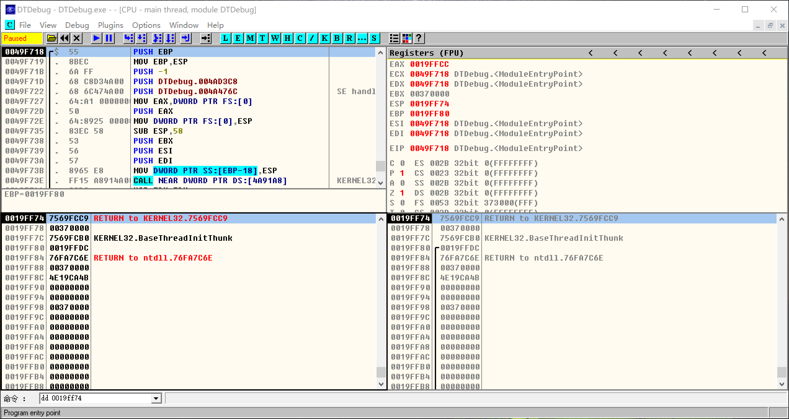

# 【笔记】01 汇编


## 00 课程概要

机器语言
汇编语言（编译器：汇编语言 → 机器语言）

C语言、C++语言：
	C语言和C++语言其实是没有本质区别的，只是编译器做的事情越来越多了，越来越强大了
	C语言是学好C++语言的基础

学习环境：
	VC6
	VS2010、VS2013、VS2016


## 01 进制

每一种进制都是完美的
忘掉十进制，忘掉进制间的转换


## 02 进制运算

八进制数：0、1、2、3、4、5、6、7、10、11、12、13、14、15、16、17、20、······

八进制加法表：

|  +   |  1   |  2   |  3   |  4   |  5   |  6   |  7   |
| :--: | :--: | :--: | :--: | :--: | :--: | :--: | :--: |
|  1   |  2   |  3   |  4   |  5   |  6   |  7   |  10  |
|  2   |  3   |  4   |  5   |  6   |  7   |  10  |  11  |
|  3   |  4   |  5   |  6   |  7   |  10  |  11  |  12  |
|  4   |  5   |  6   |  7   |  10  |  11  |  12  |  13  |
|  5   |  6   |  7   |  10  |  11  |  12  |  13  |  14  |
|  6   |  7   |  10  |  11  |  12  |  13  |  14  |  15  |
|  7   |  10  |  11  |  12  |  13  |  14  |  15  |  16  |

八进制乘法表：

|  *   |  1   |  2   |  3   |  4   |  5   |  6   |  7   |
| :--: | :--: | :--: | :--: | :--: | :--: | :--: | :--: |
|  1   |  1   |  2   |  3   |  4   |  5   |  6   |  7   |
|  2   |  2   |  4   |  6   |  10  |  12  |  14  |  16  |
|  3   |  3   |  6   |  11  |  14  |  17  |  22  |  25  |
|  4   |  4   |  10  |  14  |  20  |  24  |  30  |  34  |
|  5   |  5   |  12  |  17  |  24  |  31  |  36  |  43  |
|  6   |  6   |  14  |  22  |  30  |  36  |  44  |  52  |
|  7   |  7   |  16  |  25  |  34  |  43  |  52  |  61  |

八进制运算：
2 + 3 = 5
2 * 3 = 6
4 + 5 = 11
4 * 5 = 24
277 + 333 = 632
276 * 54 = 20250
237 - 54 = 163
234 / 4 = 47


## 03 二进制简写形式

| 十进制 | 二进制 | 十六进制 |
| :----: | :----: | :------: |
|   0    |  0000  |   0x0    |
|   1    |  0001  |   0x1    |
|   2    |  0010  |   0x2    |
|   3    |  0011  |   0x3    |
|   4    |  0100  |   0x4    |
|   5    |  0101  |   0x5    |
|   6    |  0110  |   0x6    |
|   7    |  0111  |   0x7    |
|   8    |  1000  |   0x8    |
|   9    |  1001  |   0x9    |
|   10   |  1010  |   0xA    |
|   11   |  1011  |   0xB    |
|   12   |  1100  |   0xC    |
|   13   |  1101  |   0xD    |
|   14   |  1110  |   0xE    |
|   15   |  1111  |   0xF    |


## 04 数据宽度

数据宽度：在计算机中，由于受硬件的制约，数据都是有长度限制的，超过最多宽度的数据会被丢弃

|      数据宽度      | 位宽 |                                  |        存储范围         |
| :----------------: | :--: | -------------------------------- | :---------------------: |
|     位（bit）      |  1   | □                                |        0x0 ~ 0x1        |
|    字节（byte）    |  8   | □□□□□□□□                         |       0x00 ~ 0xFF       |
|     字（word）     |  16  | □□□□□□□□□□□□□□□□                 |     0x0000 ~ 0xFFFF     |
| 双字（doubleword） |  32  | □□□□□□□□□□□□□□□□□□□□□□□□□□□□□□□□ | 0x00000000 ~ 0xFFFFFFFF |


## 05 无符号数、有符号数

无符号数：略

有符号数：
	正数：最高位是0
	负数：最高位是1


## 06 原码、反码、补码

原码：
	最高位：符号位
	其余各位：数值本身的绝对值

反码：
	正数：反码 = 原码
	负数：
		符号位：1
		其余各位：对原码取反

补码：
	正数：补码 = 原码
	负数：
		符号位：1
		其余各位：对原码取反加1

假设数据宽度为1字节：
	无符号数：0x00、0x01、······、0xFF（0 ~ 255）
	有符号数：
		正数：0x00、0x01、······、0x7F（0 ~ 127）
		负数：0x80、0x81、······、0xFF（-128 ~ -1）

假设数据宽度为1双字：
	无符号数：0x00000000、0x00000001、······、0xFFFFFFFF
	有符号数：
		正数：0x00000000、0x00000001、······、0x7FFFFFFF
		负数：0x80000000、0x80000001、······、0xFFFFFFFF


## 07 计算机不会做加法

计算机能做的运算：位运算

与运算：and（&）
1011 0001
1101 1000
1001 0000

或运算：or（|）
1011 0001
1101 1000
1111 1001

异或运算：xor（^）
1011 0001
1101 1000
0110 1001

非运算：not（~）
1101 1000
0010 0111

左移：shl（<<）
1101 1000 左移2位
0110 0000

右移：shr（>>），高位补0
1101 0101 右移2位，高位补0
0011 0101
对应于C语言：

```c
unsigned int a = 10;
printf("%d\n", a >> 2);
```

右移：sar（>>），高位补符号位
1101 0101 右移2位，高位补符号位
1111 0101
对应于C语言：

```c
int a = 10;
printf("%d\n", a >> 2);
```


## 08 位运算之加减乘除

略


## 09 汇编学习环境搭建

DTDebug


左上窗口：反汇编
右上窗口：寄存器
右下窗口：堆栈
左下窗口：内存

F8：执行


## 10 通用寄存器（上）

32位通用寄存器：EAX、ECX、EDX、EBX、ESP、EBP、ESI、EDI


MOV指令

1. 立即数到寄存器
   0x12345678 → EAX

   ```
   MOV EAX, 12345678
   ```

2. 寄存器到寄存器
   EAX → EDX
   
   ```
   MOV EDX, EAX
   ```


## 11 通用寄存器（下）

| 32位 | 16位 |  8位   |
| :--: | :--: | :----: |
| EAX  |  AX  | AL、AH |
| ECX  |  CX  | CL、CH |
| EDX  |  DX  | DL、DH |
| EBX  |  BX  | BL、BH |
| ESP  |  SP  |        |
| EBP  |  BP  |        |
| ESI  |  SI  |        |
| EDI  |  DI  |        |


## 12 内存

**每个应用程序都会有自己独立的4GB内存空间**
映射：应用程序独立的4GB内存空间 → 物理内存 → 内存条等其他硬件设备

1KB = 1024B
1MB = 1024KB
1GB = 1024MB

内存地址：32位
	0x00000000 ~ 0xFFFFFFFF


MOV指令

1. 立即数到内存
   ```
   MOV BYTE PTR DS:[00123456], 12
   MOV WORD PTR DS:[00123456], 1234
   MOV DWORD PTR DS:[00123456], 12345678
   ```

2. 寄存器到内存
   ```
   MOV BYTE PTR DS:[00123456], AL
   MOV WORD PTR DS:[00123456], AX
   MOV DWORD PTR DS:[00123456], EAX
   ```

3. 内存到寄存器
   ```
   MOV AL, BYTE PTR DS:[00123456]
   MOV AX, WORD PTR DS:[00123456]
   MOV EAX, DWORD PTR DS:[00123456]
   ```


## 13 内存地址的5种形式

1. 形式一：[立即数]
   ```
   MOV BYTE PTR DS:[00123456], 12
   MOV WORD PTR DS:[00123456], 1234
   MOV DWORD PTR DS:[00123456], 12345678
   ```

   ```
   MOV BYTE PTR DS:[00123456], AL
   MOV WORD PTR DS:[00123456], AX
   MOV DWORD PTR DS:[00123456], EAX
   ```

   ```
   MOV AL, BYTE PTR DS:[00123456]
   MOV AX, WORD PTR DS:[00123456]
   MOV EAX, DWORD PTR DS:[00123456]
   ```

2. 形式二：[reg]，reg：通用寄存器
   ```
   MOV BYTE PTR DS:[ECX], 12
   MOV WORD PTR DS:[ECX], 1234
   MOV DWORD PTR DS:[ECX], 12345678
   ```

   ```
   MOV BYTE PTR DS:[ECX], AL
   MOV WORD PTR DS:[ECX], AX
   MOV DWORD PTR DS:[ECX], EAX
   ```

   ```
   MOV AL, BYTE PTR DS:[ECX]
   MOV AX, WORD PTR DS:[ECX]
   MOV EAX, DWORD PTR DS:[ECX]
   ```

3. 形式三：[reg+立即数]，reg：通用寄存器
   ```
   MOV BYTE PTR DS:[ECX+4], 12
   MOV WORD PTR DS:[ECX+4], 1234
   MOV DWORD PTR DS:[ECX+4], 12345678
   ```

   ```
   MOV BYTE PTR DS:[ECX+4], AL
   MOV WORD PTR DS:[ECX+4], AX
   MOV DWORD PTR DS:[ECX+4], EAX
   ```

   ```
   MOV AL, BYTE PTR DS:[ECX+4]
   MOV AX, WORD PTR DS:[ECX+4]
   MOV EAX, DWORD PTR DS:[ECX+4]
   ```

4. 形式四：[reg1+reg2*{1, 2, 4, 8}]，reg1、reg2：通用寄存器
   ```
   MOV BYTE PTR DS:[EAX+ECX*4], 12
   MOV WORD PTR DS:[EAX+ECX*4], 1234
   MOV DWORD PTR DS:[EAX+ECX*4], 12345678
   ```

   ```
   MOV BYTE PTR DS:[EAX+ECX*4], DL
   MOV WORD PTR DS:[EAX+ECX*4], DX
   MOV DWORD PTR DS:[EAX+ECX*4], EDX
   ```

   ```
   MOV DL, BYTE PTR DS:[EAX+ECX*4]
   MOV DX, WORD PTR DS:[EAX+ECX*4]
   MOV EDX, DWORD PTR DS:[EAX+ECX*4]
   ```

5. 形式五：[reg1+reg2*{1, 2, 4, 8}+立即数]，reg1、reg2：通用寄存器
   ```
   MOV BYTE PTR DS:[EAX+ECX*4+4], 12
   MOV WORD PTR DS:[EAX+ECX*4+4], 1234
   MOV DWORD PTR DS:[EAX+ECX*4+4], 12345678
   ```

   ```
   MOV BYTE PTR DS:[EAX+ECX*4], DL
   MOV WORD PTR DS:[EAX+ECX*4], DX
   MOV DWORD PTR DS:[EAX+ECX*4], EDX
   ```

   ```
   MOV DL, BYTE PTR DS:[EAX+ECX*4+4]
   MOV DX, WORD PTR DS:[EAX+ECX*4+4]
   MOV EDX, DWORD PTR DS:[EAX+ECX*4+4]
   ```


## 14 小端存储模式

```
MOV DWORD PTR DS:[00000000], 12345678
```

大端模式：数据低位在高位，数据高位在低位

|    地址    | 内存 |
| :--------: | :--: |
| 0x00000000 | 0x12 |
| 0x00000001 | 0x34 |
| 0x00000002 | 0x56 |
| 0x00000003 | 0x78 |

小端模式：数据低位在低位，数据高位在高位

|    地址    | 内存 |
| :--------: | :--: |
| 0x00000000 | 0x78 |
| 0x00000001 | 0x56 |
| 0x00000002 | 0x34 |
| 0x00000003 | 0x12 |

命令：
	db 地址：以一个字节查看内存
	dw 地址：以两个字节查看内存
	dd 地址：以四个字节查看内存





## 15 常用汇编指令

imm8：8位立即数
imm16：16位立即数
imm32：32位立即数

r8：8位通用寄存器
r16：16位通用寄存器
r32：32位通用寄存器

m8：8位内存
m16：16位内存
m32：32位内存


MOV指令：

```
MOV r8, imm8
MOV r16, imm16
MOV r32, imm32
```

```
MOV r8/m8, r8
MOV r16/m16, r16
MOV r32/m32, r32
```

```
MOV r8, r8/m8
MOV r16, r16/m16
MOV r32, r32/m32
```


ADD指令：

```
ADD r8/m8, imm8
ADD r16/m16, imm16
ADD r32/m32, imm32
ADD r16/m16, imm8
ADD r32/m32, imm8
```

```
ADD r8/m8, r8
ADD r16/m16, r16
ADD r32/m32, r32
```

```
ADD r8, r8/m8
ADD r16, r16/m16
ADD r32, r32/m32
```


SUB指令：

```
SUB r8/m8, imm8
SUB r16/m16, imm16
SUB r32/m32, imm32
SUB r16/m16, imm8
SUB r32/m32, imm8
```

```
SUB r8/m8, r8
SUB r16/m16, r16
SUB r32/m32, r32
```

```
SUB r8, r8/m8
SUB r16, r16/m16
SUB r32, r32/m32
```


AND指令：

```
AND r8/m8, imm8
AND r16/m16, imm16
AND r32/m32, imm32
AND r16/m16, imm8
AND r32/m32, imm8
```

```
AND r8/m8, r8
AND r16/m16, r16
AND r32/m32, r32
```

```
AND r8, r8/m8
AND r16, r16/m16
AND r32, r32/m32
```


OR指令：

```
OR r8/m8, imm8
OR r16/m16, imm16
OR r32/m32, imm32
OR r16/m16, imm8
OR r32/m32, imm8
```

```
OR r8/m8, r8
OR r16/m16, r16
OR r32/m32, r32
```

```
OR r8, r8/m8
OR r16, r16/m16
OR r32, r32/m32
```


XOR指令：

```
XOR r8/m8, imm8
XOR r16/m16, imm16
XOR r32/m32, imm32
XOR r16/m16, imm8
XOR r32/m32, imm8
```

```
XOR r8/m8, r8
XOR r16/m16, r16
XOR r32/m32, r32
```

```
XOR r8, r8/m8
XOR r16, r16/m16
XOR r32, r32/m32
```


NOT指令：

```
NOT r8/m8
NOT r16/m16
NOT r32/m32
```


## 16 常用汇编指令

EFL：标志寄存器

|  位  | 31 ~ 12 |    11    |    10    |      9       |    8     |    7     |   6    |  5   |      4       |  3   |    2     |  1   |    0     |
| :--: | :-----: | :------: | :------: | :----------: | :------: | :------: | :----: | :--: | :----------: | :--: | :------: | :--: | :------: |
| 标志 |         |    OF    |    DF    |      IF      |    TF    |    SF    |   ZF   |      |      AF      |      |    PF    |      |    CF    |
| 含义 |         | 溢出标志 | 方向标志 | 中断使能标志 | 单步标志 | 符号标志 | 零标志 |      | 辅助进位标志 |      | 奇偶标志 |      | 进位标志 |


MOVS指令

1. DS:[ESI] → ES:[EDI]（1字节）
   DF = 0：ESI + 1 → ESI、EDI + 1 → EDI
   DF = 1：ESI - 1 → ESI、EDI - 1 → EDI

   ```
   MOVS BYTE PTR ES:[EDI], BYTE PTR DS:[ESI]
   ```
   
   简写为：
   ```
   MOVSB
   ```

2. DS:[ESI] → ES:[EDI]（2字节）
   DF = 0：ESI + 2 → ESI、EDI + 2 → EDI
   DF = 1：ESI - 2 → ESI、EDI - 2 → EDI

   ```
   MOVS WORD PTR ES:[EDI], WORD PTR DS:[ESI]
   ```

   简写为：
   ```
   MOVSW
   ```

3. DS:[ESI] → ES:[EDI]（4字节）
   DF = 0：ESI + 4 → ESI、EDI + 4 → EDI
   DF = 1：ESI - 4 → ESI、EDI - 4 → EDI

   ```
   MOVS DWORD PTR ES:[EDI], DWORD PTR DS:[ESI]
   ```

   简写为：
   ```
   MOVSD
   ```


STOS指令

1. AL → ES:[EDI]
   DF = 0：EDI + 1 → EDI
   DF = 1：EDI - 1 → EDI

   ```
   STOS BYTE PTR ES:[EDI]
   ```

   简写为：
   ```
   STOSB
   ```

2. AX → ES:[EDI]
   DF = 0：EDI + 2 → EDI
   DF = 1：EDI - 2 → EDI

   ```
   STOS WORD PTR ES:[EDI]
   ```

   简写为：
   ```
   STOSW
   ```

3. EAX → ES:[EDI]
   DF = 0：EDI + 4 → EDI
   DF = 1：EDI - 4 → EDI

   ```
   STOS DWORD PTR ES:[EDI]
   ```

   简写为：
   ```
   STOSD
   ```


REP指令
ECX：计数寄存器

```
MOV ECX, 10
REP MOVSD
```

```
MOV ECX, 10
REP STOSD
```


## 17 堆栈相关指令


堆栈顶部地址：0x001A0000
堆栈底部地址：0x0019C000

堆栈的使用：顶部 → 底部

ESP：栈顶指针寄存器


PUSH指令
	修改ESP
	向栈顶压入数据

```
PUSH imm32
PUSH r16/m16
PUSH r32/m32
```

1. ESP - 2 → ESP
   ```
   PUSH r16/m16
   ```

2. ESP - 4 → ESP
   ```
   PUSH imm32
   PUSH r32/m32
   ```
   
   ```
   PUSH EAX
   ```
   
   等价于：
   
   ```
   SUB ESP, 4
   MOV DWORD PTR SS:[ESP], EAX
   ```


POP指令
	从栈顶弹出数据
	修改ESP

```
POP r16/m16
POP r32/m32
```

1. ESP + 2 → ESP
   ```
   POP r16/m16
   ```

2. ESP + 4 → ESP
   ```
   POP r32/m32
   ```
   
   ```
   POP EAX
   ```
   
   等价于：
   
   ```
   MOV EAX, DWORD PTR SS:[ESP]
   ADD ESP, 4
   ```


## 18 修改EIP的指令

JMP指令

```
JMP imm32/r32/m32
```

相当于：

```
MOV EIP, imm32/r32/m32
```


CALL指令

```
CALL imm32/r32/m32
```

相当于：

```
PUSH 下一行指令的地址
MOV EIP, imm32/r32/m32
```

CALL与JMP唯一的区别：CALL在堆栈中存储下一行指令的地址


RET指令

```
RET
```

相当于：

```
POP EIP
```


## 19 反调试之Fake F8

F7：单步步入（进入CALL），设置EFLAGS的TF位
F8：单步步过 （不进入CALL），在下一行设置断点（0xCC）
F2：设置断点（0xCC）


## 20 汇编眼中的函数

函数：一系列指令的集合，完成某个会重复使用的特定功能

执行一个函数 / 调用函数：CALL
传参：寄存器、堆栈
EAX：存储函数的返回值


## 21 堆栈传参

略


## 22 堆栈平衡

堆栈平衡：
	如果要返回父程序，则一定要保证在执行RET指令之前，ESP指向的是压入栈中的地址
	如果通过堆栈传递参数了，则在函数执行完毕后，要平衡参数导致的堆栈变化

外平栈：

```
PUSH 1
PUSH 2
CALL 函数地址
ADD ESP, 8
···
（函数地址）
MOV EAX, DWORD PTR SS:[ESP+8]
ADD EAX, DWORD PTR SS:[ESP+4]
RET
```

内平栈：

```
PUSH 1
PUSH 2
CALL 函数地址
···
（函数地址）
MOV EAX, DWORD PTR SS:[ESP+8]
ADD EAX, DWORD PTR SS:[ESP+4]
RET 8
```


## 23 外挂是什么

略


## 24 ESP寻址

堆栈平衡：外平栈、内平栈


## 25 EBP寻址

EBP：栈底指针寄存器

```
···
CALL 函数地址
···
（函数地址）
PUSH EBP
MOV EBP, ESP
···
MOV ESP, EBP
POP EBP
RET
```


## 26 JCC

EFL：标志寄存器

|  位  | 31 ~ 12 |    11    |    10    |      9       |    8     |    7     |   6    |  5   |      4       |  3   |    2     |  1   |    0     |
| :--: | :-----: | :------: | :------: | :----------: | :------: | :------: | :----: | :--: | :----------: | :--: | :------: | :--: | :------: |
| 标志 |         |    OF    |    DF    |      IF      |    TF    |    SF    |   ZF   |      |      AF      |      |    PF    |      |    CF    |
| 含义 |         | 溢出标志 | 方向标志 | 中断使能标志 | 单步标志 | 符号标志 | 零标志 |      | 辅助进位标志 |      | 奇偶标志 |      | 进位标志 |

CF（Carry Flag）：无符号数运算溢出时CF=1，否则CF=0

```
MOV AL, 0FE
ADD AL, 2
```

```
MOV AL, 7F
SUB AL, 0FF
```

PF（Parity Flag）：最低有效字节包含偶数个1时PF=1，否则PF=0，用于奇偶校验

```
MOV AL, 0CE
ADD AL, 0
```

 AF（Auxiliary Carry Flag）：结果的第3位发生进位或借位时AF=1，否则为AF=0，用于BCD算数运算

ZF（Zero Flag）：结果为0时ZF=1，否则ZF=0，用于CMP、TEST指令

判断两个值是否相等：

```
MOV EAX, 100
MOV ECX, 100
CMP EAX, ECX
```

判断某个值是否为0：

```
TEST EAX, EAX
```

SF（Sign Flag）：结果为负时SF=1，否则SF=0

```
MOV AL, 0FE
ADD AL, 2
```

```
MOV AL, 7F
ADD AL, 2
```

OF（Overflow Flag）：有符号数运算溢出时OF=1，否则OF=0

```
MOV AL, 7F
ADD AL, 2
```

无符号数运算是否溢出看CF位
有符号数运算是否溢出看OF位

DF（Direction Flag）：用于串指令（MOVS、STOS、LODS、CMPS、SCAS）
	STD指令：设置DF（DF=1） → 自动递减，从高地址向低地址方向处理字符串
	CLD指令：清除DF（DF=0） → 自动递增，从低地址向高地址方向处理字符串


| 指令 | 跳转条件   | 标志位 |
| :--- | ---------- | :----: |
| JE   | 结果相等   | ZF = 1 |
| JNE  | 结果不相等 | ZF = 0 |


| 指令 | 跳转条件  | 标志位 |
| :--- | --------- | :----: |
| JZ   | 结果为0   | ZF = 1 |
| JNZ  | 结果不为0 | ZF = 0 |


| 指令 | 跳转条件   | 标志位 |
| :--- | ---------- | :----: |
| JS   | 结果为负   | SF = 1 |
| JNS  | 结果不为负 | SF = 0 |


| 指令      | 跳转条件            | 标志位 |
| :-------- | ------------------- | :----: |
| JP / JPE  | 结果中1的个数为偶数 | PF = 1 |
| JNP / JPO | 结果中1的个数为奇数 | PF = 0 |


| 指令 | 跳转条件     | 标志位 |
| :--- | ------------ | :----: |
| JO   | 结果溢出     | OF = 1 |
| JNO  | 结果没有溢出 | OF = 0 |


| 指令 | 跳转条件     | 标志位 |
| :--- | ------------ | :----: |
| JC   | 结果进位     | CF = 1 |
| JNC  | 结果没有进位 | CF = 0 |


| 指令      | 跳转条件                              | 标志位 |
| :-------- | ------------------------------------- | :----: |
| JB / JNAE | 结果小于 / 结果不大于等于（无符号数） | CF = 1 |
| JNB / JAE | 结果不小于 / 结果大于等于（无符号数） | CF = 0 |


| 指令      | 跳转条件                              |      标志位      |
| :-------- | ------------------------------------- | :--------------: |
| JBE / JNA | 结果小于等于 / 结果不大于（无符号数） | CF = 1 或 ZF = 1 |
| JNBE / JA | 结果不小于等于 / 结果大于（无符号数） | CF = 0 且 ZF = 0 |


| 指令      | 跳转条件                              | 标志位  |
| :-------- | ------------------------------------- | :-----: |
| JL / JNGE | 结果小于 / 结果不大于等于（有符号数） | SF ≠ OF |
| JNL / JGE | 结果不小于 / 结果大于等于（有符号数） | SF = OF |


| 指令      | 跳转条件                              |      标志位       |
| :-------- | ------------------------------------- | :---------------: |
| JLE / JNG | 结果小于等于 / 结果不大于（有符号数） | SF ≠ OF 或 ZF = 1 |
| JNLE / JG | 结果不小于等于 / 结果大于（有符号数） | SF = OF 且 ZF = 0 |


常用：
	JNBE / JA：结果不小于等于 / 结果大于（无符号数），CF=0且ZF=0时跳转
	JNLE / JG：结果不小于等于 / 结果大于（有符号数），SF=OF且ZF=0时跳转

```
MOV AL, 0FF
MOV CL, 1
CMP AL, CL
JA 跳转地址
```

```
MOV AL, 0FF
MOV CL, 1
CMP AL, CL
JG 跳转地址
```

