# 【笔记】C


## 01 C语言的汇编表示

C、C++：编程语言
VC6、VS：集成开发环境

VC6：
	F9：断点
	F7：构建
	F5：运行
	F10：单步（不进入CALL）
	F11：单步（进入CALL）


## 02 参数传递与返回值

函数定义：

```c
返回类型 函数名(参数列表) {
}
```

```c
int plus(int x, int y) {
	return x + y;
}
```

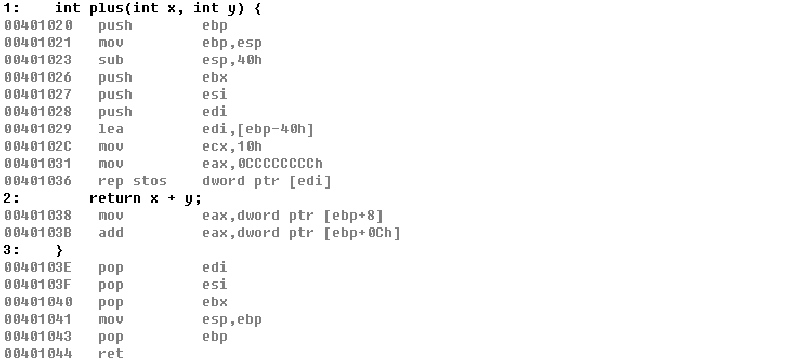

```c
plus(1, 2);
```

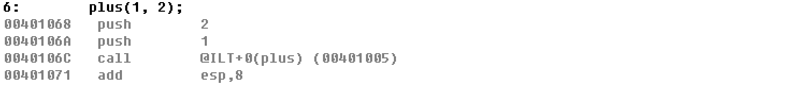

参数传递顺序：从右向左


## 03 变量

char：1字节
short：2字节
int：4字节

全局变量
	编译时就已经确定了内存地址
	变量名：内存地址的别名
	公用的：任何程序都可以改
	游戏外挂找的“基址”（示例：CE搜索基址）

```c
int x;

void main() {
	x = 1;
	return;
}
```

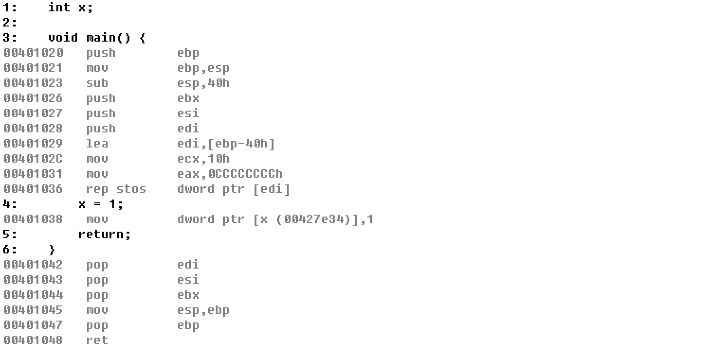

局部变量：
	函数内部申请的
	在堆栈中分配的，程序执行时才分配（内存地址是不确定的）
	只能在函数内部使用，其他函数不能使用

```c
void f() {
	int x = 1;
}

void main() {
	f();
	return;
}
```

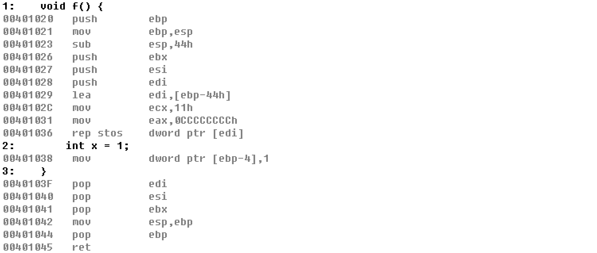

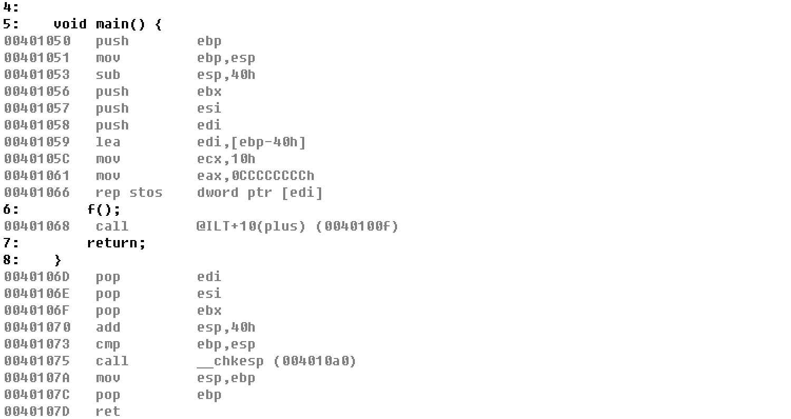

初始值：
	全局变量：可以没有初始值而直接使用，系统默认初始值为0
	局部变量：在使用前必须要赋值


## 04 变量与参数的内存布局

参数在内存中的位置
局部变量在内存中的位置
返回值如何返回，如何使用

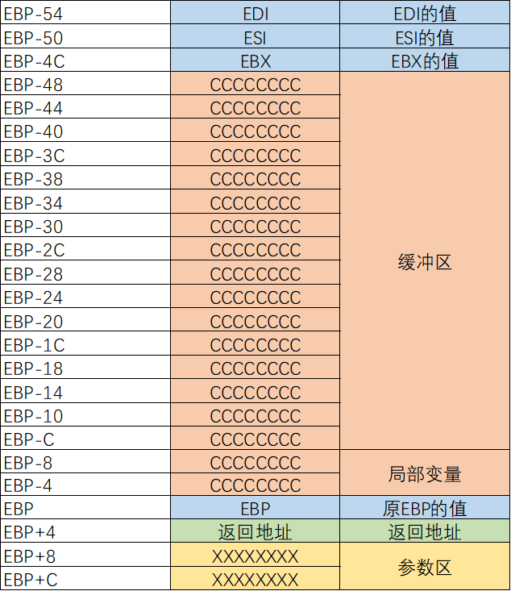

```c
int plus(int x, int y) {
	int z = x + y;
	return z;
}

void main() {
	int r = plus(1, 2);
	return;
}
```


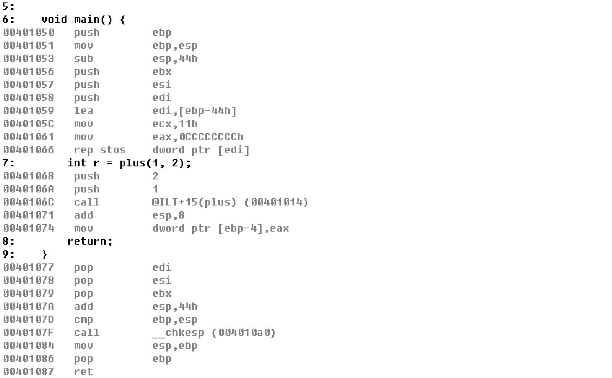

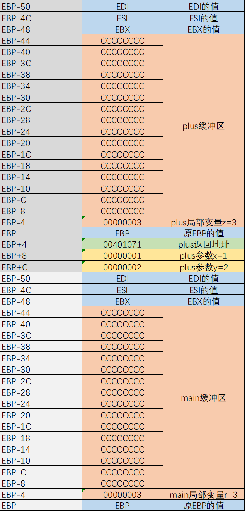


## 05 函数嵌套调用的内存布局

Build分为Release版和Debug版两种：
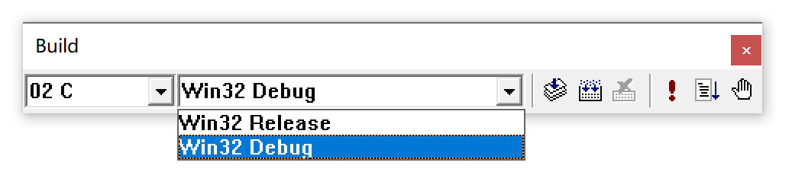


```c
int plus1(int x, int y) {
	int z = x + y;
	return z;
}

int plus2(int x, int y, int z) {
	int m = plus1(x, y);
	int n = m + z;
	return n;
}

void main() {
	int r = plus2(1, 2, 3);
	return;
}
```

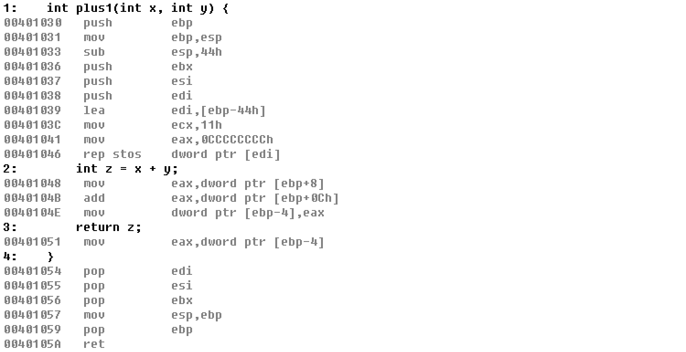

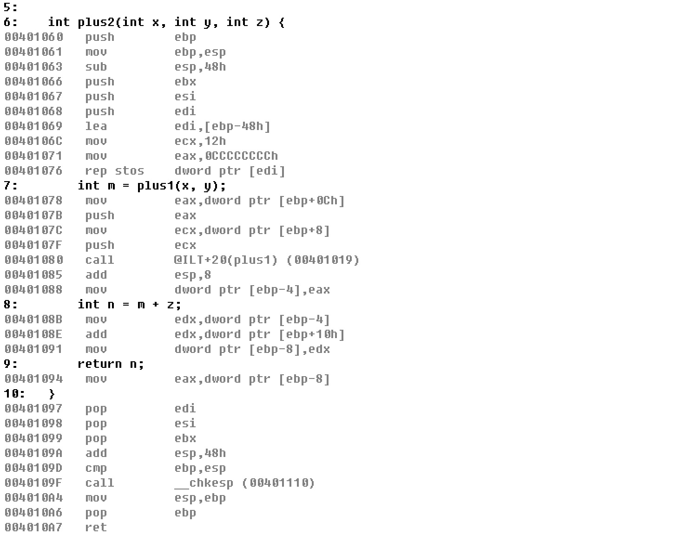


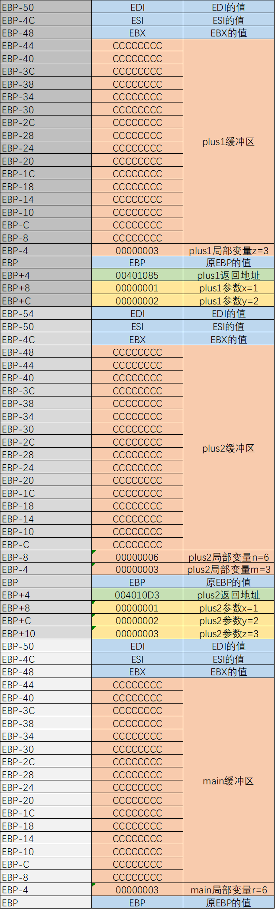


```c
int plus1(int x, int y) {
	return x + y;
}

int plus2(int x, int y, int z) {
	return plus1(x, y) + z;
}

void main() {
	int r = plus2(1, 2, 3);
	return;
}
```

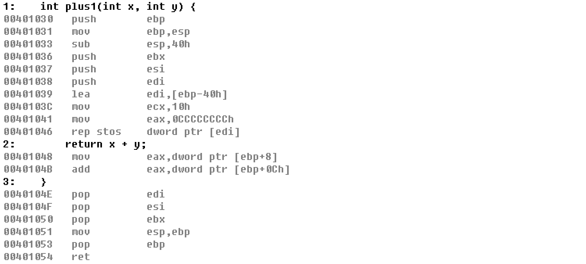

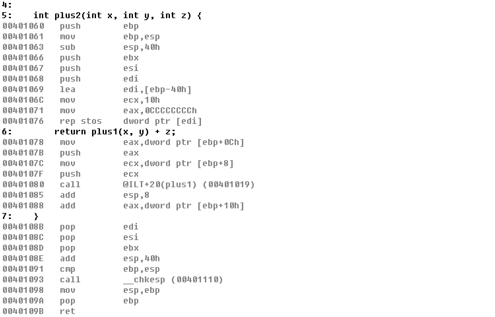

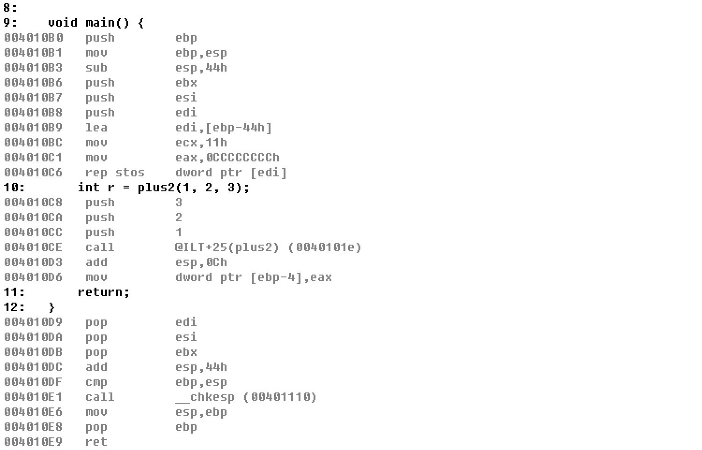

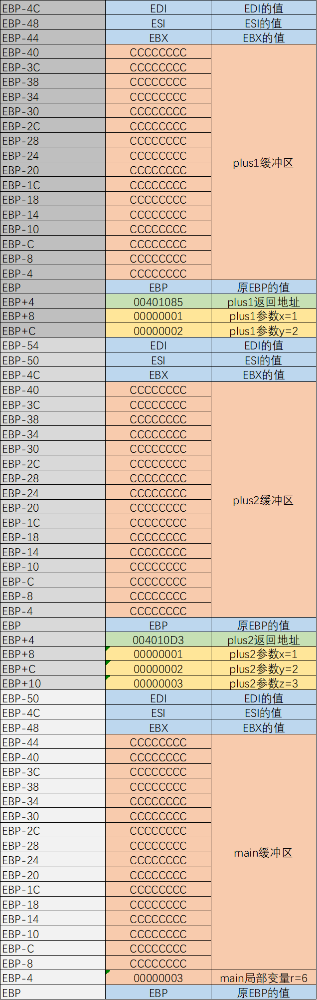


## 06 整数类型

C语言变量类型
	基本类型
		整数类型
		浮点类型
	构造类型
		数组类型
		结构体类型
		共用体（联合）类型
	指针类型
	空类型（void）

整数类型：

| 整数类型 | 宽度 | 字节 |          范围           |
| :------: | :--: | :--: | :---------------------: |
|   char   | 8位  |  1   |       0x00 ~ 0xFF       |
|  short   | 16位 |  2   |     0x0000 ~ 0xFFFF     |
|   int    | 32位 |  4   | 0x00000000 ~ 0xFFFFFFFF |
|   long   | 32位 |  4   | 0x00000000 ~ 0xFFFFFFFF |

16位的计算机：short宽度 = int宽度 = 16位
32位及以上的计算机：int宽度 = long宽度 = 32位

**int对char的符号扩展？**


## 07 浮点类型

浮点类型：

|  浮点类型   | 宽度 | 字节 |
| :---------: | :--: | :--: |
|    float    | 32位 |  4   |
|   double    | 64位 |  8   |
| long double | 64位 |  8   |

```c
float f = 1.23F;
double d = 4.56;
long double l = 7.89L;
```

IEEE编码规范

float：32位

|   31   | 30 ~ 23  |  22 ~ 0  |
| :----: | :------: | :------: |
|  1位   |   8位    |   23位   |
| 符号位 | 指数部分 | 尾数部分 |

double：64位

|   63   | 62 ~ 52  |  51 ~ 0  |
| :----: | :------: | :------: |
|  1位   |   11位   |   52位   |
| 符号位 | 指数部分 | 尾数部分 |

转浮点类型：
	整数部分：一定可以完整地转换成二进制
	小数部分：不可能做到完全精确

8.25转float类型：
	整数部分：1000（8）
	小数部分：0.01（0.25）
	1000.01 → 1.00001 * 2<sup>3</sup>
		符号位：0
		指数部分：10000010
		小数部分：00001000000000000000000
		→ 0  10000010  00001000000000000000000
		→ 0100  0001  0000  0100  0000  0000  0000  0000
		→ 0x41040000
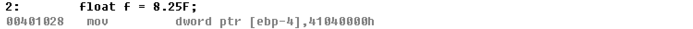

精度：尾数的位数
	float：7位有效数字，2<sup>23</sup> = 8388608（7位）
	double：16位有效数字，2<sup>52</sup> = 4503599627370496（16位）


## 08 字符与字符串

char：8位，1个字节

ASCII（American Standard Code for Information Interchange，美国标准信息交换代码）

```c
#include<stdio.h>

void main() {
	int x = 'A';
	printf("%d\n", x);
	putchar(x);
	putchar('\n');
	return;
}
```

运行结果：

```
65
A
```


```c
#include<stdio.h>

void main() {
	char x = 65;
	printf("%d\n", x);
	putchar(x);
	putchar('\n');
	return;
}
```

运行结果：

```
65
A
```


printf函数：

```c
#include<stdio.h>

void main() {
	int x = 0xFFFFFFFF;
	printf("%d\n", x);
	printf("%u\n", x);
	printf("%x\n", x);
	return;
}
```

运行结果：

```
-1
4294967295
ffffffff
```


```c
#include<stdio.h>

void main() {
	float f = 3.1415F;
	printf("%6.2f\n", f);
	return;
}
```

运行结果：

```
  3.14
```


```c
#include<stdio.h>

void main() {
	char buffer[20] = "Hello, World!";
	printf("%s\n", buffer);
	return;
}
```

运行结果：

```
Hello, World!
```

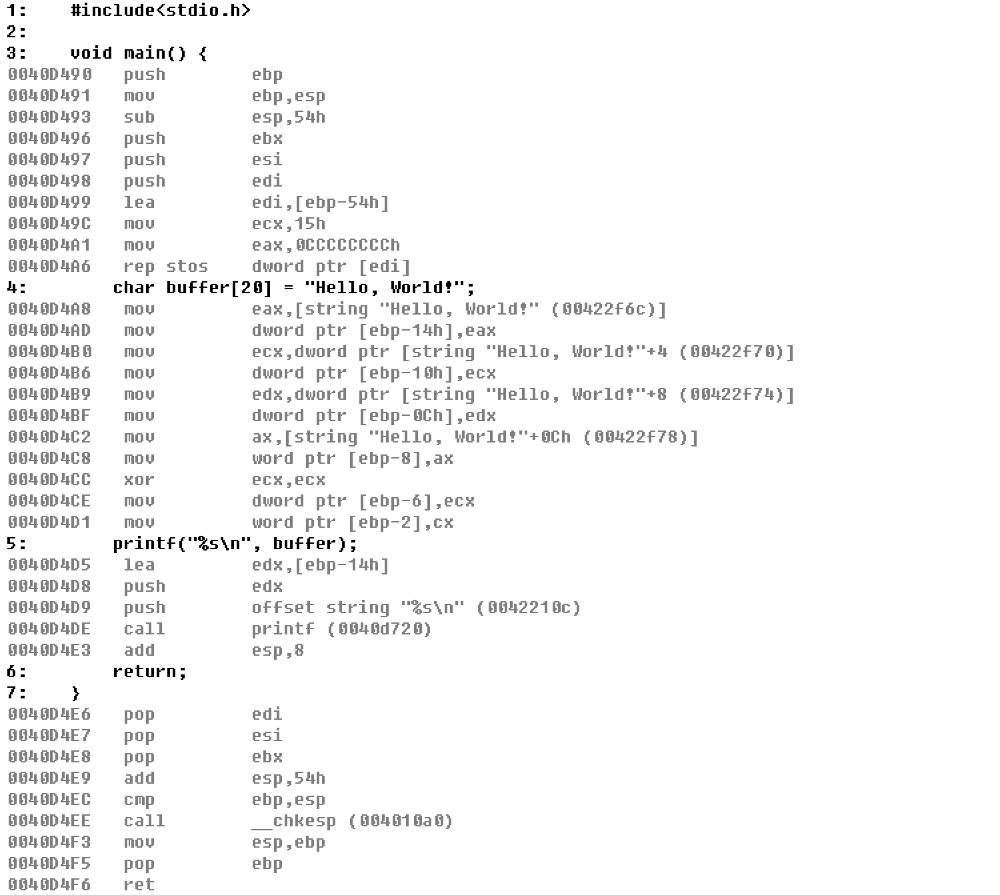

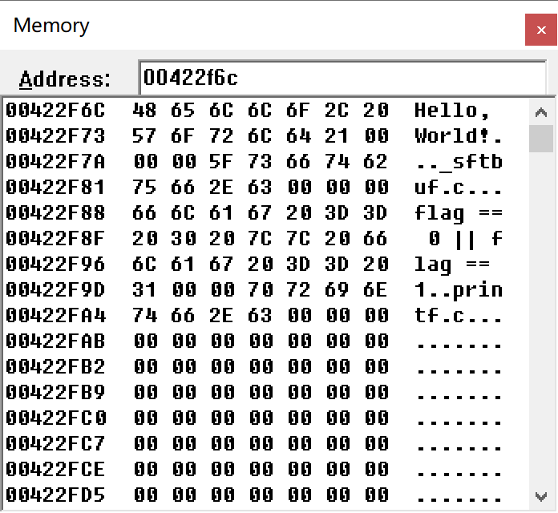


## 09 中文字符

国标码：
一个汉字：两个大于127的字符连在一起
7000多个简体汉字
GB2312、GB2312-80

```c
#include<stdio.h>

void main() {
	char buffer[20] = "中国";
	printf("%s\n", buffer);
	return;
}
```

运行结果：

```
中国
```

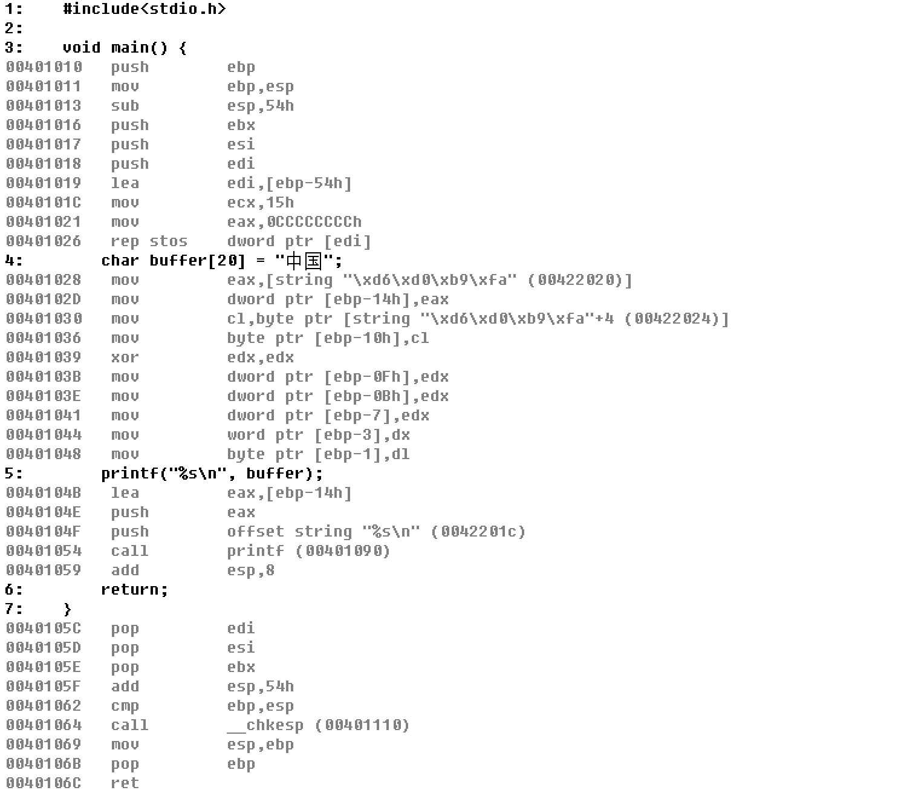

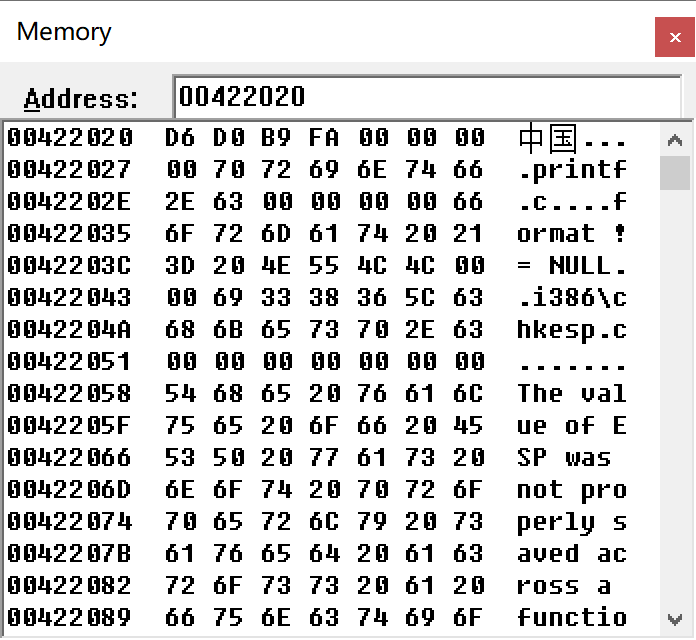


## 10 运算符与表达式

类型转换：char、short → int → float → double

```c
void main() {
	char x = 1;
	short y = 2;
	int z = x + y;
	return;
}
```

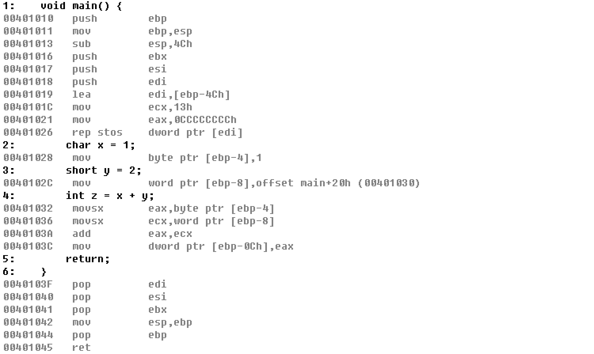

```c
void main() {
	char x = 1;
	short y = 2;
	short z = x + y;
	return;
}
```

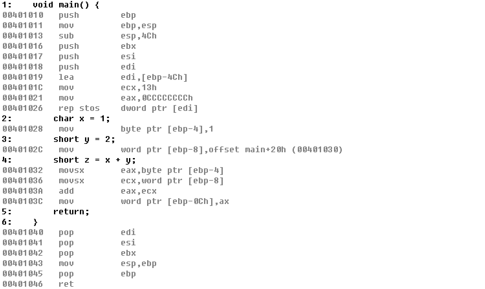

算术运算符：+（加）、-（减）、*（乘）、/（除）、%（取余）、++（自增）、--（自减）
关系运算符：<（小于）、<=（小于等于）、>（大于）、>=（大于等于）、==（等于）、!=（不等于）
逻辑运算符：&&（逻辑与）、||（逻辑或）、!（逻辑非）
位运算符：<<、>>、&、|、~、^
赋值运算符：=
条件运算符：?:

### 算术运算符

#### +（加）

```c
void main() {
	int x = 1;
	int y = 2;
	int z = x + y;
	return;
}
```

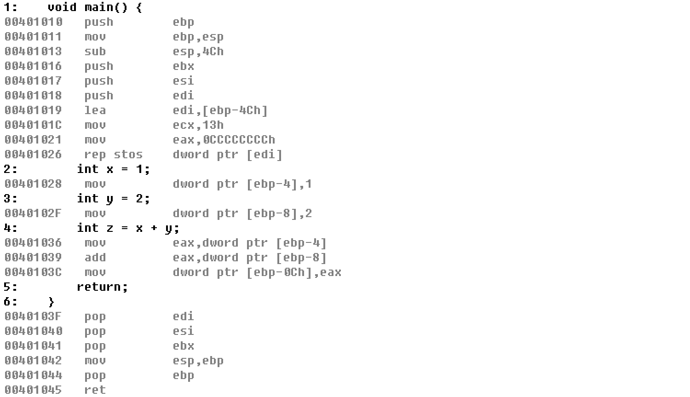

#### -（减）

```c
void main() {
	int x = 1;
	int y = 2;
	int z = x - y;
	return;
}
```


#### *（乘）

```c
void main() {
	int x = 1;
	int y = 2;
	int z = x * y;
	return;
}
```


#### /（除）

```c
void main() {
	int x = 1;
	int y = 2;
	int z = x / y;
	return;
}
```


#### %（取余）

```c
void main() {
	int x = 1;
	int y = 2;
	int z = x % y;
	return;
}
```

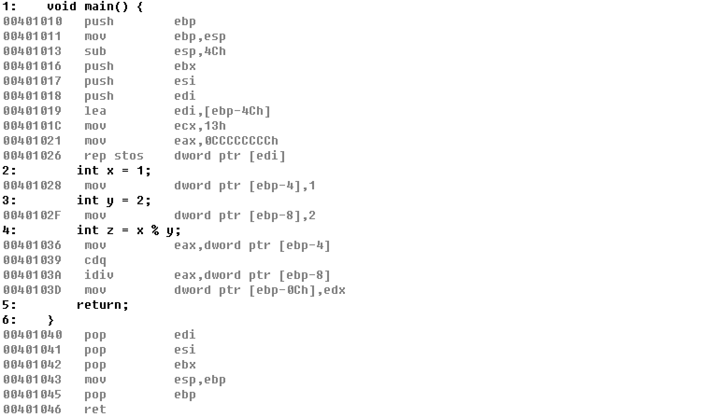

#### ++（自增）

x++：先运算，再自增
++x：先自增，再运算

```c
void main() {
	int x = 1;
	x++;
	return;
}
```

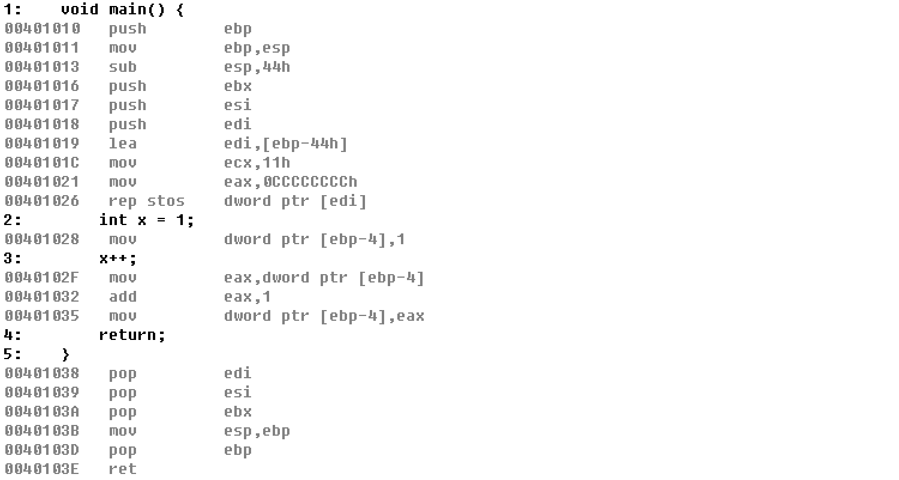

```c
void main() {
	int x = 1;
	++x;
	return;
}
```


```c
void main() {
	int x = 1;
	int y = x++;
	return;
}
```


```c
void main() {
	int x = 1;
	int y = ++x;
	return;
}
```

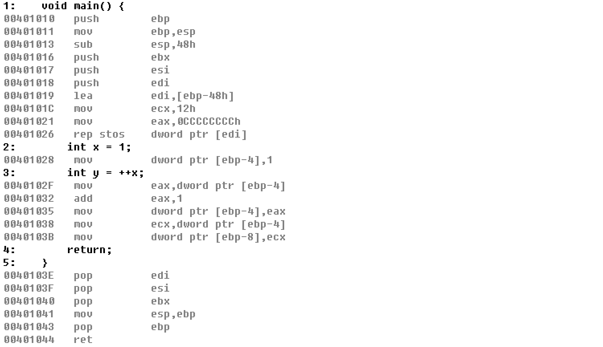

#### --（自减）

x--：先运算，再自减
--x：先自减，再运算

```c
void main() {
	int x = 1;
	x--;
	return;
}
```

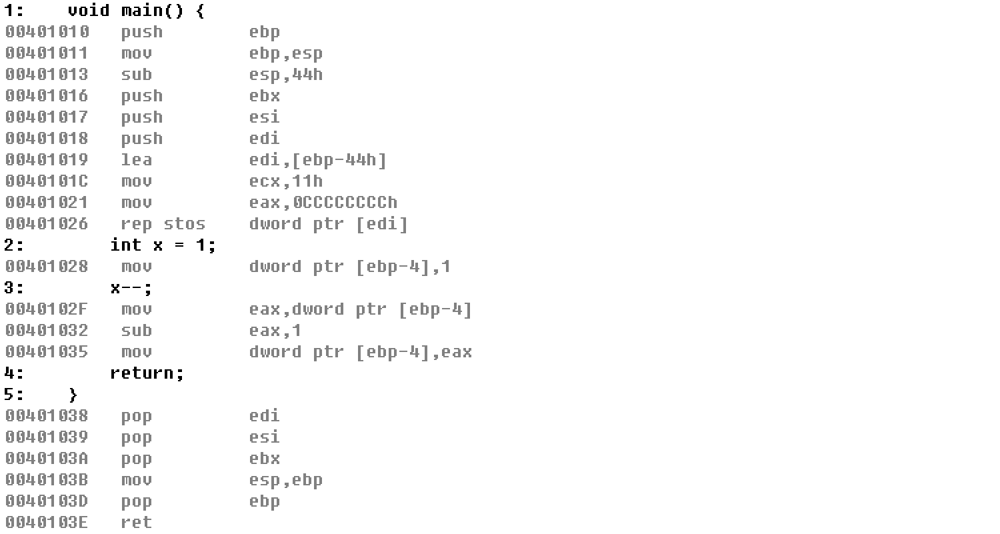

```c
void main() {
	int x = 1;
	--x;
	return;
}
```

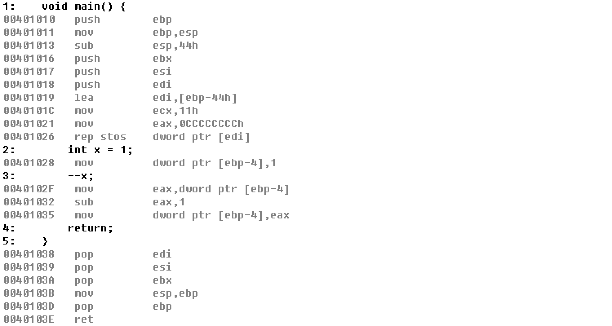

```c
void main() {
	int x = 1;
	int y = x--;
	return;
}
```

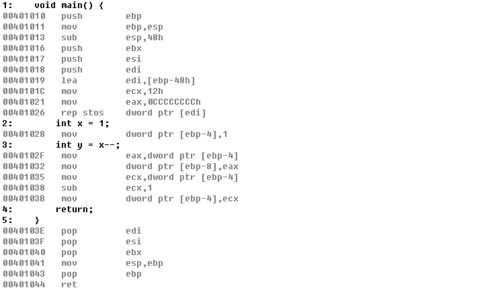

```c
void main() {
	int x = 1;
	int y = --x;
	return;
}
```

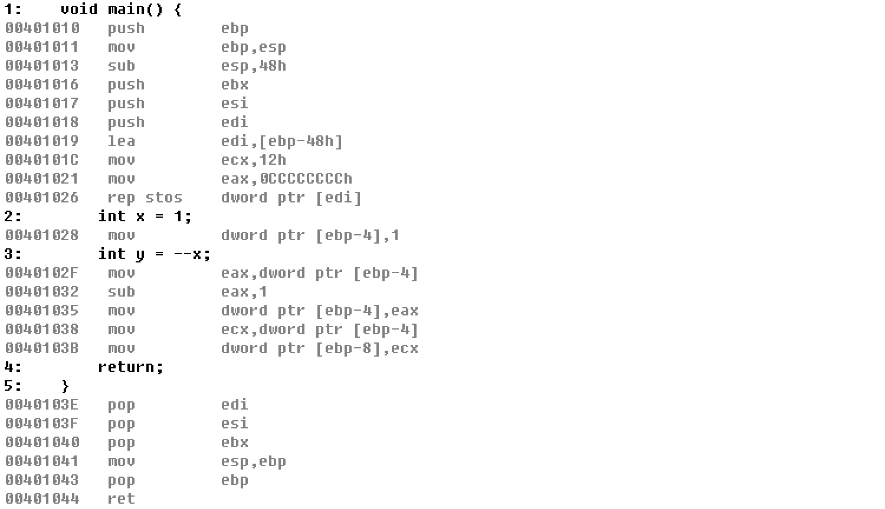

### 关系运算符

#### <（小于）

```
```
