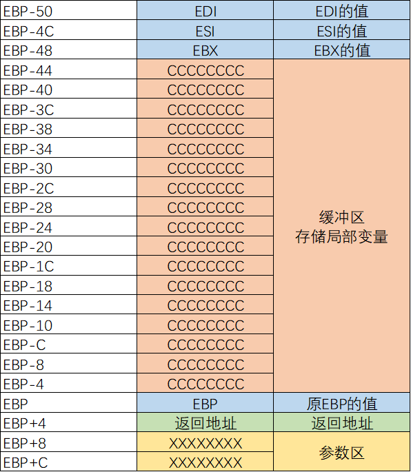
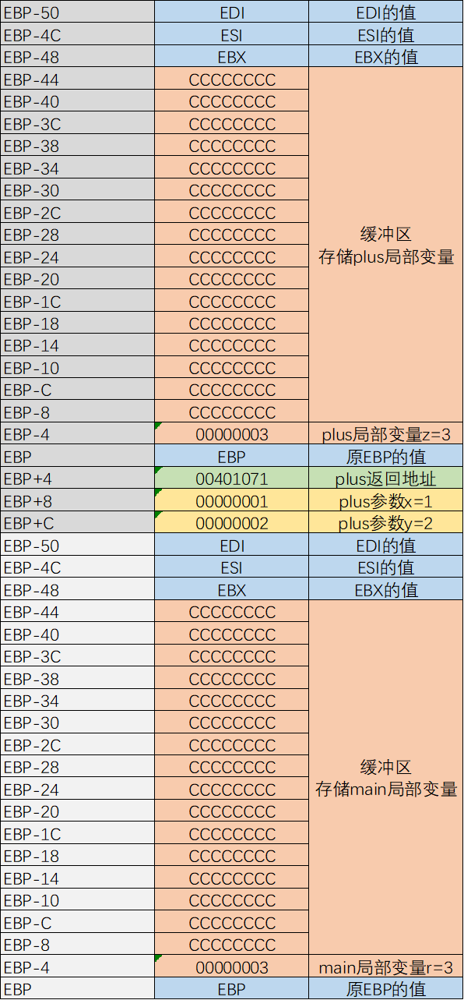
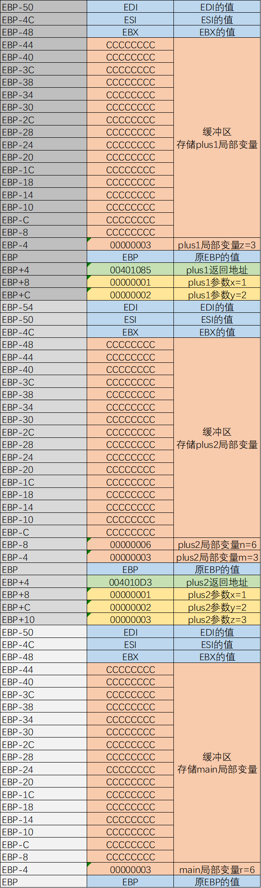

# 【笔记】C


## 01 C语言的汇编表示

C、C++：编程语言
VC6、VS：集成开发环境

VC6：
	F9：断点
	F7：构建
	F5：运行
	F10：单步（不进入CALL）
	F11：单步（进入CALL）


## 02 参数传递与返回值

函数定义：

```c
返回类型 函数名(参数列表) {
}
```

```c
int plus(int x, int y) {
	return x + y;
}
```


```c
plus(1, 2);
```


参数传递顺序：从右向左


## 03 变量

char：1字节
short：2字节
int：4字节

全局变量
	编译时就已经确定了内存地址
	变量名：内存地址的别名
	公用的：任何程序都可以改
	游戏外挂找的“基址”（示例：CE搜索基址）

```c
int x;

void main() {
	x = 1;
	return;
}
```


局部变量：
	函数内部申请的
	在堆栈中分配的，程序执行时才分配（内存地址是不确定的）
	只能在函数内部使用，其他函数不能使用

```c
void f() {
	int x = 1;
}

void main() {
	f();
	return;
}
```


初始值：
	全局变量：可以没有初始值而直接使用，系统默认初始值为0
	局部变量：在使用前必须要赋值


## 04 变量与参数的内存布局

参数在内存中的位置
局部变量在内存中的位置
返回值如何返回，如何使用



```c
int plus(int x, int y) {
	int z = x + y;
	return z;
}

void main() {
	int r = plus(1, 2);
	return;
}
```





## 05 函数嵌套调用的内存布局

Build分为Release版和Debug版两种：


```c
int plus1(int x, int y) {
	int z = x + y;
	return z;
}

int plus2(int x, int y, int z) {
	int m = plus1(x, y);
	int n = m + z;
	return n;
}

void main() {
	int r = plus2(1, 2, 3);
	return;
}
```





```c
int plus1(int x, int y) {
	return x + y;
}

int plus2(int x, int y, int z) {
	return plus1(x, y) + z;
}

void main() {
	int r = plus2(1, 2, 3);
	return;
}
```


## 06 整数类型

C语言变量类型
	基本类型整数类型

